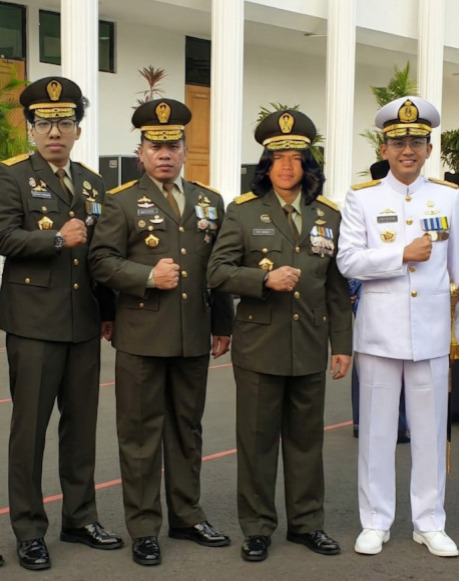

# Tugas Besar IF2224 Teori Bahasa Formal dan Otomata

## Milestone 1: Lexical Analysis

### 1. Identitas Kelompok
**Kelompok: SBT-Tubes-IF2224-2026**
* 13524032 - Juan Oloando Simanungkalit
* 13524036 - Edward David Rumahorbo
* 13524056 - Reinhard Alfonzo Hutabarat
* 13524102 - Manuel Timothy Silalahi

### 2. Deskripsi Program
Program ini adalah **Lexical Analyzer (Lexer)** untuk bahasa pemrograman *Arion*, yang dibangun sebagai pemenuhan Milestone 1 Tugas Besar IF2224. Lexer bertugas membaca teks *source code* karakter demi karakter (sebagai *character stream*) dan mengubahnya menjadi unit-unit bermakna yang disebut Token (*token stream*).

Program ini diimplementasikan secara modular, murni, dan manual menggunakan bahasa **C++ standar GNU** dengan menerapkan konsep **Deterministic Finite Automata (DFA)**. Program tidak menggunakan pustaka pembangkit otomatis seperti Regex atau Flex. Mesin membaca berkas masukan `.txt`, melakukan penelusuran deterministik rakus (*longest match*), menangani *whitespace* serta komentar, dan mencetak 52 jenis token tervalidasi ke dalam berkas keluaran `.txt`.

### 3. Requirements
Untuk mengompilasi dan menjalankan program ini, diperlukan perangkat lunak berikut:
* **GNU C++ Compiler (GCC):** Kompilator `g++` yang mendukung fitur C++ standar modern (C++11 atau versi lebih baru).
* **Make Utility:** Dibutuhkan untuk mengeksekusi skrip kompilasi otomatis (`Makefile`).
* **Sistem Operasi:** Bebas (Linux, Windows menggunakan MinGW/WSL, atau macOS).

### 4. Cara Instalasi dan Penggunaan Program
1. **Kloning Repositori**
   Unduh kode program ke direktori lokal Anda:
   ```bash
   git clone https://github.com/Rizelbit/SBT-Tubes-IF2224-2026
   cd SBT-Tubes-IF2224-2026
   ```
   

2. **Kompilasi Program**
   Pastikan Anda berada di akar repositori (atau di dalam direktori `src/` tempat berkas `Makefile` berada). Jalankan perintah berikut:
   ```bash
   make
   ```
   
   Perintah ini akan menyatukan seluruh berkas C++ modular menjadi sebuah *executable file* (seperti `lexer` atau `lexer.exe`).

3. **Cara Menjalankan Program**
   Eksekusi *file* hasil kompilasi tersebut melalui terminal. Format dasar penjalanan program (tergantung implementasi *Command Line Arguments* pada `main.cpp`):
   ```bash
   ./lexer input<nomor_test>.txt> output<nomor_test>.txt
   ```
   
   *Contoh Eksekusi Pengujian:*
   ```bash
   ./lexer input1.txt output1.txt
   ```
   

### 5. Pembagian Tugas
* **13524032 - Juan Oloando Simanungkalit (25%)**: Mengembangkan logika implementasi DFA DelimsComments (`Lexer_DelimsComments.cpp`), merancang dan menggambarkan visualisasi diagram DFA, serta menyusun keseluruhan Laporan.
* **13524036 - Edward David Rumahorbo (25%)**: Mengembangkan logika implementasi DFA Operators & Komparasi (`Lexer_Operators.cpp`), merancang dan menggambarkan visualisasi diagram DFA, serta menyusun keseluruhan Laporan.
* **13524056 - Reinhard Alfonzo Hutabarat (25%)**: Mengembangkan logika implementasi DFA Keywords (`Lexer_Keywords.cpp`), merancang dan menggambarkan visualisasi diagram DFA, serta menyusun keseluruhan Laporan.
* **13524102 - Manuel Timothy Silalahi (25%)**: Mengembangkan logika implementasi DFA Literals (`Lexer_Literals.cpp`), merancang dan menggambarkan visualisasi diagram DFA, serta menyusun keseluruhan Laporan.