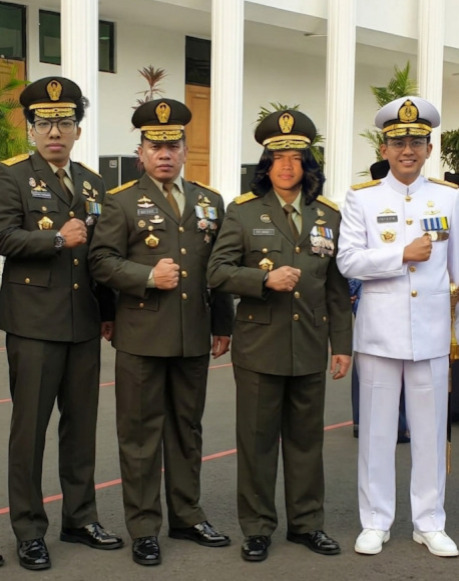

# Tugas Besar IF2224 Teori Bahasa Formal dan Otomata


## Milestone 3: Semantic Analysis

### 1. Identitas Kelompok
**Kelompok: SBT-Tubes-IF2224-2026**
* 13524032 - Juan Oloando Simanungkalit
* 13524036 - Edward David Rumahorbo
* 13524056 - Reinhard Alfonzo Hutabarat
* 13524102 - Manuel Timothy Silalahi

### 2. Deskripsi Program
Program ini adalah **Semantic Analyzer** untuk bahasa pemrograman *Arion*, yang dibangun sebagai pemenuhan Milestone 3 Tugas Besar IF2224. Program ini merupakan kelanjutan dari Milestone 1 (Lexical Analyzer) dan Milestone 2 (Syntax Analyzer/Parser). Pada milestone ini, program tidak hanya memastikan struktur sintaks source code valid, tetapi juga menganalisis makna program melalui pembentukan **Abstract Syntax Tree (AST)**, dekorasi AST, pengelolaan **Symbol Table**, serta pengecekan tipe dan scope.

Semantic Analyzer diimplementasikan secara modular menggunakan bahasa **C++ standar GNU**. Program memproses source code Arion melalui pipeline Lexer → Parser → AST Builder → Semantic Analyzer. Hasil akhir program berupa **Decorated AST**, daftar **Semantic Error** jika ditemukan, serta tabel simbol `tab`, `btab`, dan `atab` yang mencatat identifier, blok/scope, serta tipe array. Program menerima source code Arion dalam format `.txt`, kemudian mencetak hasil semantic analysis ke terminal dan menyimpannya ke dalam berkas keluaran `.txt`.

### 3. Requirements
Untuk mengompilasi dan menjalankan program ini, diperlukan perangkat lunak berikut:
* **GNU C++ Compiler (GCC):** Kompilator `g++` yang mendukung standar C++17 atau lebih baru.
* **Make Utility:** Dibutuhkan untuk mengeksekusi skrip kompilasi otomatis (`Makefile`).
* **Sistem Operasi:** Bebas (Linux, Windows menggunakan MinGW/WSL, atau macOS).

### 4. Cara Instalasi dan Penggunaan Program

1. **Kloning Repositori**
   Unduh kode program ke direktori lokal Anda:
   ```bash
   git clone https://github.com/Rizelbit/SBT-Tubes-IF2224-2026
   cd SBT-Tubes-IF2224-2026
   ```

2. **Kompilasi Program**
   Pastikan Anda berada di akar repositori. Jalankan perintah berikut di WSL:
   ```bash
   make
   ```
   Perintah ini akan mengompilasi seluruh berkas C++ modular (Lexer, Parser, AST, Symbol Table, Type System, dan Semantic Analyzer) menjadi sebuah *executable* bernama `arion`.

3. **Cara Menjalankan Program**
   Letakkan file input source code Arion di dalam direktori `test/milestone-3/`, kemudian jalankan:
   ```bash
   ./arion <nama_file_input.txt> <nama_file_output.txt>
   ```
   *Contoh Eksekusi Pengujian:*
   ```bash
   ./arion input1.txt output1.txt
   ```
   Hasil semantic analysis akan disimpan di `test/milestone-3/output1.txt`. Program juga dapat dijalankan menggunakan path lengkap:
   ```bash
   ./arion test/milestone-3/input1.txt test/milestone-3/output1.txt
   ```

4. **Membersihkan File Build**
   ```bash
   make clean
   ```

### 5. Struktur Direktori
```
SBT-Tubes-IF2224-2026/
├── Makefile
├── README.md
├── ARAHAN.md
├── Spesifikasi Milestone 3 - Tubes IF2224 TBFO.pdf
├── src/
│   ├── Token.hpp / Token.cpp              (Definisi token dan TokenType)
│   ├── Lexer.hpp / Lexer.cpp              (Dispatcher utama Lexer)
│   ├── Lexer_Literals.cpp                 (DFA untuk literal: int, real, char, string)
│   ├── Lexer_Operators.cpp                (DFA untuk operator dan komparasi)
│   ├── Lexer_Keywords.cpp                 (DFA untuk keyword dan identifier)
│   ├── Lexer_DelimsComments.cpp           (DFA untuk delimiter dan komentar)
│   ├── ParseNode.hpp / ParseNode.cpp      (Struktur data node Parse Tree)
│   ├── Parser.hpp                         (Deklarasi kelas Parser)
│   ├── Parser.cpp                         (Utilitas inti: match, peekToken, reportError)
│   ├── Parser_Core.cpp                    (program, block, statement, statement-list)
│   ├── Parser_Declarations.cpp            (const, type, var, array, record, enum, range)
│   ├── Parser_ControlFlow.cpp             (if, case, while, repeat, for, procedure, function)
│   ├── Parser_Expression.cpp              (expression, term, factor, variable, assignment, call)
│   ├── AST.hpp / AST.cpp                  (Struktur data AST dan anotasi semantic)
│   ├── ASTBuilder.hpp / ASTBuilder.cpp    (Konversi Parse Tree menjadi AST)
│   ├── ASTPrinter.hpp / ASTPrinter.cpp    (Pencetak Decorated AST)
│   ├── TypeSystem.hpp / TypeSystem.cpp    (Aturan type compatibility dan inferensi tipe)
│   ├── SymbolTable.hpp / SymbolTable.cpp  (Implementasi tab, btab, atab, dan scope lookup)
│   ├── SemanticAnalyzer.hpp / .cpp        (Visitor semantic analysis)
│   ├── SemanticErrors.hpp / .cpp          (Format pesan semantic error)
│   └── Main.cpp                           (Entry point program)
├── doc/
│   ├── Laporan-1-SBT.pdf
│   └── Laporan-2-SBT.pdf
└── test/
    ├── milestone-1/
    │   ├── input1.txt ... input5.txt
    │   └── output1.txt ... output5.txt
    ├── milestone-2/
    │   ├── input1.txt ... input5.txt
    │   └── output1.txt ... output5.txt
    └── milestone-3/
        ├── input1.txt ... input5.txt
        └── output1.txt ... output5.txt
```

### 6. Pembagian Tugas

#### Milestone 1 — Lexical Analysis
* **13524032 - Juan Oloando Simanungkalit (25%)**: Mengembangkan DFA Delimiters & Comments (`Lexer_DelimsComments.cpp`), merancang diagram DFA, dan menyusun laporan.
* **13524036 - Edward David Rumahorbo (25%)**: Mengembangkan DFA Operators & Komparasi (`Lexer_Operators.cpp`), merancang diagram DFA, dan menyusun laporan.
* **13524056 - Reinhard Alfonzo Hutabarat (25%)**: Mengembangkan DFA Keywords & Identifier (`Lexer_Keywords.cpp`), merancang diagram DFA, dan menyusun laporan.
* **13524102 - Manuel Timothy Silalahi (25%)**: Mengembangkan DFA Literals (`Lexer_Literals.cpp`), merancang diagram DFA, dan menyusun laporan.

#### Milestone 2 — Syntax Analysis
* **13524032 - Juan Oloando Simanungkalit (25%)**: Mengembangkan struktur data Parse Tree (`ParseNode.hpp/cpp`), utilitas inti Parser (`Parser.hpp`, `Parser.cpp`), dan struktur kerangka program (`Parser_Core.cpp`).
* **13524036 - Edward David Rumahorbo (25%)**: Mengembangkan parser untuk deklarasi dan tipe data (`Parser_Declarations.cpp`), mencakup const, type, var, array, record, enum, dan range.
* **13524056 - Reinhard Alfonzo Hutabarat (25%)**: Mengembangkan parser untuk control flow dan subprogram (`Parser_ControlFlow.cpp`), mencakup if, case, while, repeat, for, procedure, dan function.
* **13524102 - Manuel Timothy Silalahi (25%)**: Mengembangkan parser untuk ekspresi dan pernyataan (`Parser_Expression.cpp`), mencakup expression, term, factor, variable, assignment, dan procedure/function call.

#### Milestone 3 — Semantic Analysis
* **13524032 - Juan Oloando Simanungkalit (25%)**: Mengembangkan struktur data AST (`AST.hpp/cpp`), AST Builder (`ASTBuilder.hpp/cpp`), AST Printer (`ASTPrinter.hpp/cpp`), revisi parser untuk `while` dan `for` agar menggunakan compound statement, serta integrasi pipeline pada `Main.cpp`.
* **13524036 - Edward David Rumahorbo (25%)**: Mengembangkan Type System (`TypeSystem.hpp/cpp`), Symbol Table (`SymbolTable.hpp/cpp`), predefined identifiers, serta representasi `tab`, `btab`, dan `atab`.
* **13524056 - Reinhard Alfonzo Hutabarat (25%)**: Mengembangkan semantic visitor untuk deklarasi dan tipe data (`SemanticAnalyzer.hpp/cpp`), mencakup const, type, var, array, record, procedure, function, parameter, dan validasi scope deklarasi.
* **13524102 - Manuel Timothy Silalahi (25%)**: Mengembangkan semantic visitor untuk statement dan expression (`SemanticAnalyzer.cpp`, `SemanticErrors.hpp/cpp`), mencakup assignment, operator, if, while, repeat, for, procedure/function call, array access, record field access, serta error handling.
